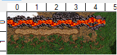

# Resize .h3m map file

## Requirements

- Node.js v22 or higher
- `gzip` executable in global `PATH`

## Limitations

- Only HotA maps are supported

## Usage

This script does not have complete parsing of the .h3m structure.

To make it work you have to make the following customizations in your map
to be able to properly find the offset in the file structure with the first segment of the land (on coordinates `x=0;y=0`).

1. Place rectangle of Grass from the top left corner (coordinates `x=0;y=0`) to at least `x=5;y=2`
2. Place two segments of Snow at `x=0;y=0` and `x=1;y=0`
3. Place two segments of Lava at `x=2;y=0` and `x=3;y=0`
4. Place Lava river from `x=0;y=0` to `x=4;y=0`
5. Place Dirt road from `x=0;y=0` to `x=4;y=0`

It has to look like:



And then to execute the script:

```sh
npm start -- --src-file=/path/to/source.h3m --out-file=/path/to/out.h3m --new-size=[S|M|L|XL|H|XH|G]
```

## References

- [.h3m structure description](https://github.com/potmdehex/homm3tools/blob/master/h3m/h3mlib/h3m_structures/h3m_description.english.txt)
